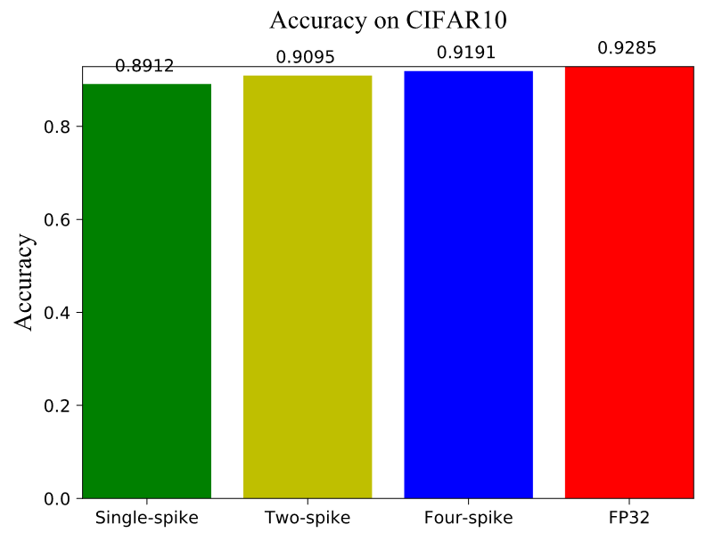
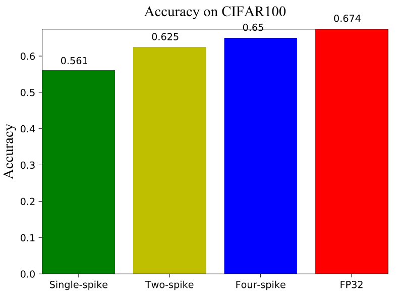
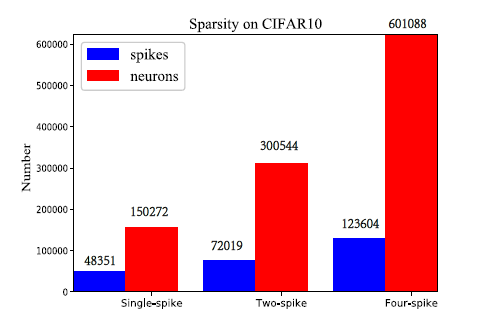
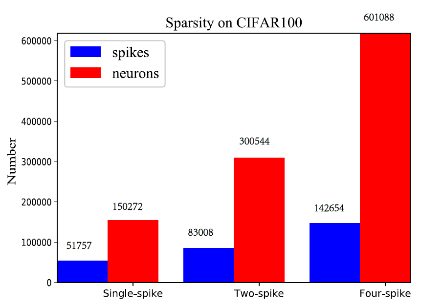
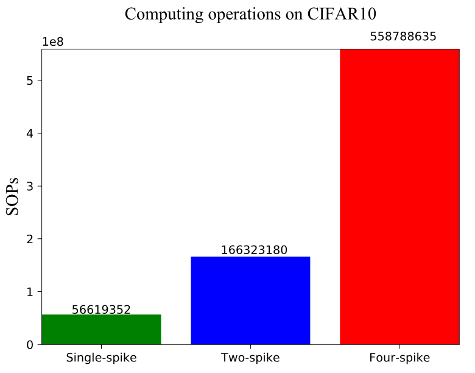
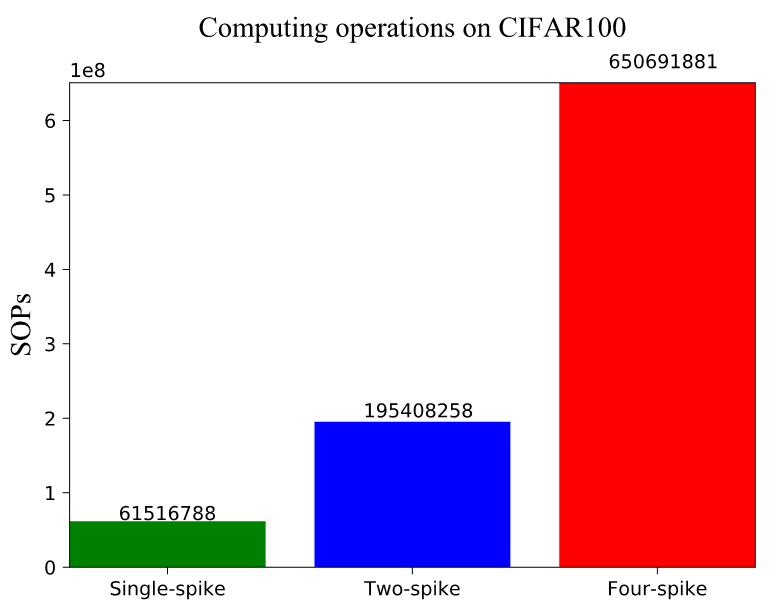

# Instructions for running CIFAR10 experiments


## File overview:

- `README_VGG.md` - this readme file for CIFAR10.<br>

- `CIFAR10` - VGG-Net on CIFAR10.<br>
  - `tensorlayer` - our provided tensorlayer package.<br>
  - `Quant_VGG_CIFAR10.py` - the training script for `VGG-Net` with optional quantization precision *`k`* on CIFAR10.<br>
  - `Spiking_VGG_CIFAR10.py` - the evaluation script for `spiking VGG-Net` with optional quantization precision *`k`* on CIFAR10.<br>
  - `FP32_VGG_CIFAR10.py` - the training script for `VGG-Net` with `full precision (float32)` on CIFAR10.<br>
  - `spiking_ulils.py` - the functions of spiking convolution and linear.<br>
  - `figs` - visualization folder for SNN performance.<br>
    - `sops.py` - the synaptic operations (SOPs) script for `spiking VGG-Net` with different quantization precisions on CIFAR10.
    - `sparsity.py` - the spike sparsity script for `spiking VGG-Net` with different quantization precisions on CIFAR10.<br>


- `CIFAR100` - VGG-Net on CIFAR100.<br>
  - `tensorlayer` - our provided tensorlayer package.<br>
  - `Quant_VGG_CIFAR100.py` - the training script for `VGG-Net` with optional quantization precision *`k`* on CIFAR100.<br>
  - `Spiking_VGG_CIFAR100.py` - the evaluation script for `spiking VGG-Net` with optional quantization precision *`k`* on CIFAR100.<br>
  - `FP32_VGG_CIFAR100.py` - the training script for `VGG-Net` with `full precision (float32)` on CIFAR100.<br> 
  - `spiking_ulils.py` - the functions of spiking convolution and linear.<br>
  - `figs` - visualization folder for SNN performance.<br>
    - `sops.py` - the synaptic operations (SOPs) script for `spiking VGG-Net` with different quantization precisions on CIFAR100.
    - `sparsity.py` - the spike sparsity script for `spiking VGG-Net` with different quantization precisions on CIFAR100.<br>

## ANN Training
### **Before running**:
* Please note your default dataset folder will be `./data`

* please modify the command line parameters: `--resume True`, and `--learning_rate 0.0001` for another 200 epochs after the first 200 epochs. Totally, 400 training epoch need be performed.  

### **Run the code**:
### **Run the code**:
for example (training, *k=0*, *B=1*, VGG-Net, CIFAR10):
```sh
$ cd VGG/CIFAR10
$ python Quant_VGG_CIFAR10.py  --k 0 --B 1--resume False --learning_rate 0.001 --mode 'training'
```
finally, it will generate the corresponding model files including: `checkpoint`, `model_CIFAR10_advanced.ckpt.data-00000-of-00001`, `model_CIFAR10_advanced.ckpt.index`, `model_CIFAR10_advanced.ckpt.meta` and `model_cifar_10.npz`.

## ANN Inference
### **Run the code**:
for example (inference, *k=0*, *B=1* VGG-Net, CIFAR10):
```sh
$ python Quant_VGG_CIFAR10.py --k 0 --B 1--resume True  --mode 'inference'
```
Then, it will print the corresponding ANN test accuracy.

## SNN inference
### **Run the code**:
for example (inference, *k=0*, *B=1*, VGG-Net, CIFAR10):
```sh
$ python Spiking_VGG_CIFAR10.py --k 0 --B 1
```
it will generate the corresponding log files including: `accuracy.txt`, `sop_num.txt`, and `spike_num.txt` in `./figs/k0B1/`.

## Visualization

### **Firing sparsity**:
```sh
$ python accuracy_speed.py
$ python sparsity.py
```
### **Computing operations**:
```sh
$ python sops.py
```

## Results
Our proposed spiking VGG-Net achieves the following performances on CIFAR10/100:

VGG-Net: 64C3\*2-2P2-128C3\*2-P2-256C3\*2-P2-512C3-512<br>

### **Accuracy**:
#### **CIFAR10**:
| Quantization Precision  | Network | Epochs | ANN | SNN | Time Steps |
| ------------------ |---------------- | -------------- | ------------- | ------------- | ------------- |
| Full-precision | VGG-Net |   400   |  92.85% | N/A | N/A |
| k=1, B=2 | VGG-Net |   400   |  91.91% | 91.91% |  1 |
| k=1, B=2 (10% noise)| VGG-Net |   400   |  91.91% | 90.32%% |  1 |
| k=1, B=2 (20% noise) | VGG-Net |   400   |  91.91% | 89.65% |  1 |
||

#### **CIFAR100**:
| Quantization Precision  | Network | Epochs | ANN | SNN | Time Steps |
| ------------------ |---------------- | -------------- | ------------- | ------------- | ------------- |
| Full-precision | VGG-Net |   400   |  67.4% | N/A | N/A |
| k=1, B=2 | VGG-Net |   400   |  65.0% | 65.0% |  1 |
| k=1, B=2 (10% noise)| VGG-Net |   400   |  65.0% | 63.93% |  1 |
| k=1, B=2 (20% noise) | VGG-Net |   400   |  65.0% | 62.25% |  1 |
||

<figure class="half">
    
</figure>

### **Firing sparsity**:
<figure class="half">
    
</figure>

### **Computing operations**:
<figure class="half">
    
</figure>

## Notes
* We do not consider the synaptic operations in the input encoding layer and the spike outputs in the last classification layer (membrane potential accumulation instead) for both original ANN counterparts and converted SNNs.<br>
* We also provide some scripts for visualization in `./figs`, please move to this folder and directly run the three scripts.

## More question:<br>
- There might be a little difference of results for multiple training repetitions, because of the randomization. 
- Please feel free to reach out here or email: 1801111301@pku.edu.cn, if you have any questions or difficulties. I'm happy to help guide you.

